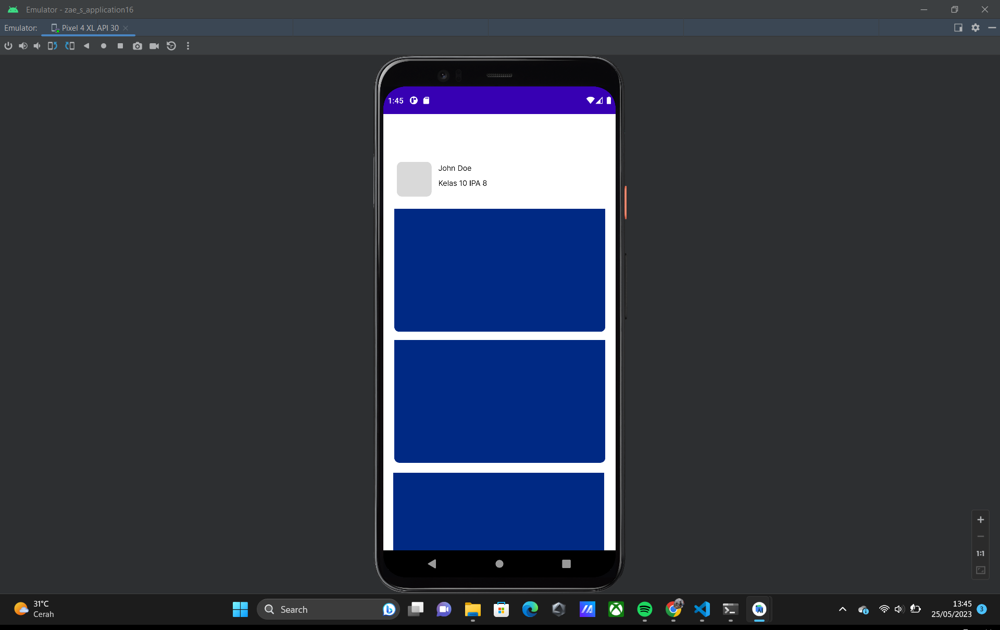
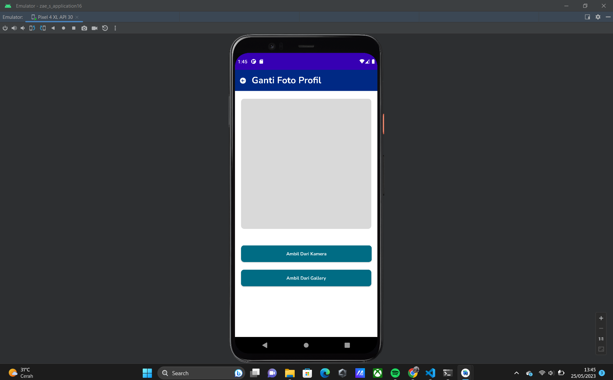
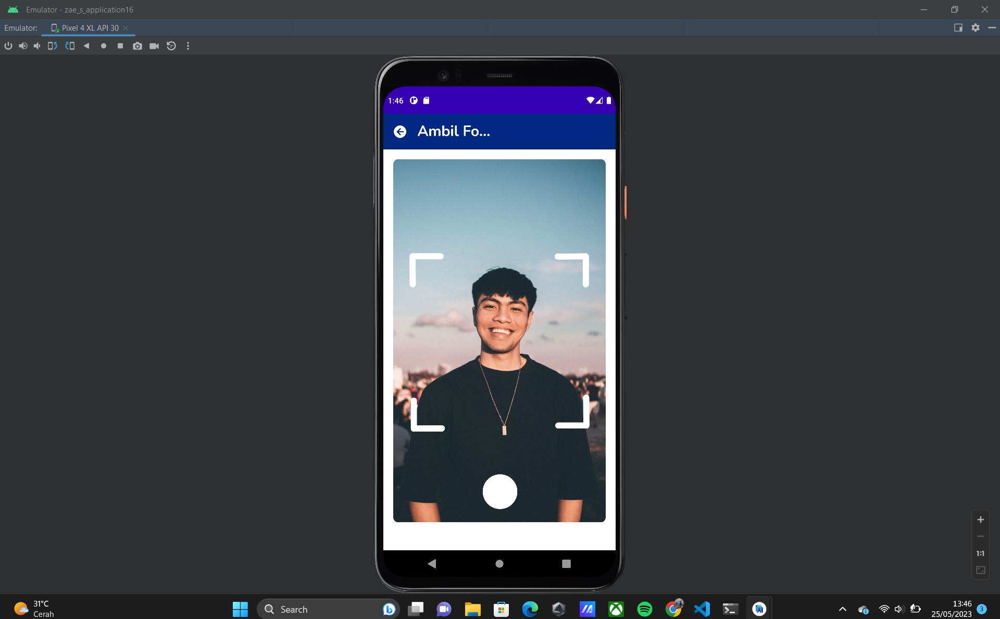
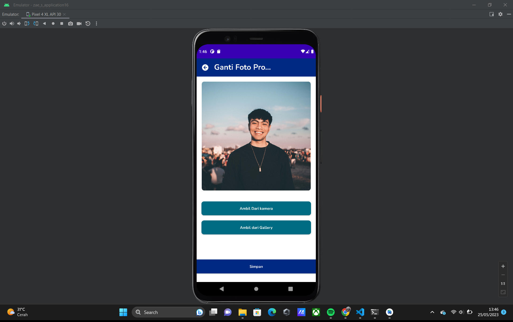
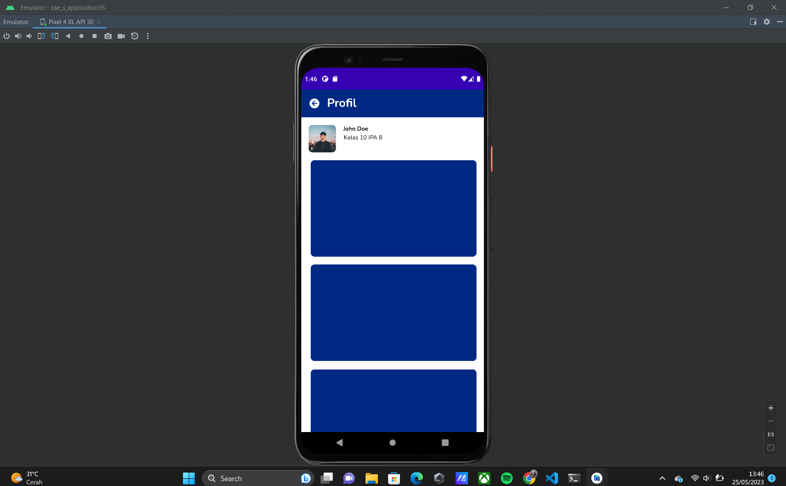
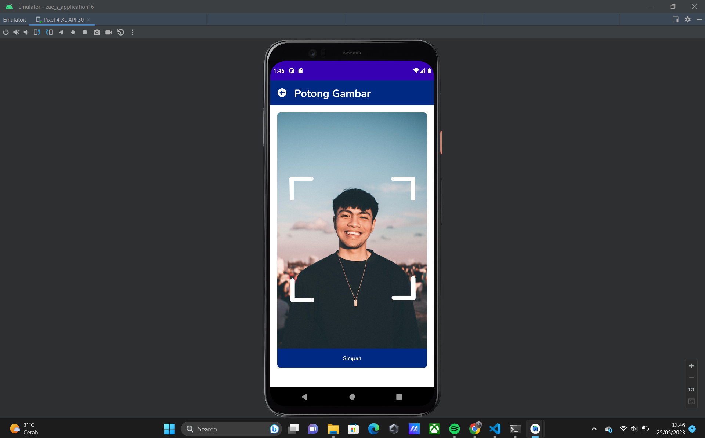
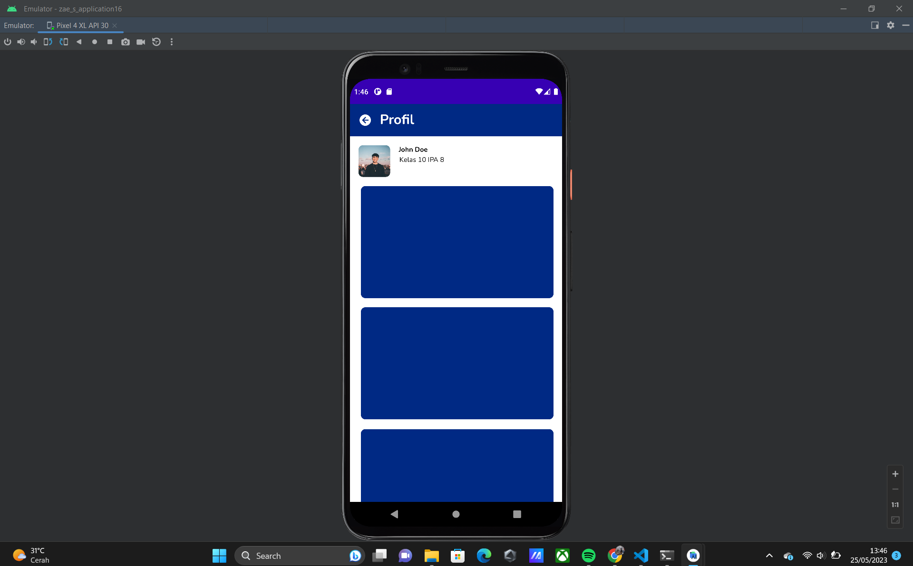

# FROND-END-TEST
NAMA : Muhammad ZaeZhydan Ramadhan
EMAIL : zhydanzae17@gmail.com
CARA MENJALANKAN APPS : ME RUNNING CODE DENGAN KONFIGURASI DEVICE YANG ADA => MEMBUKA APLIKASI YANG BERNAMA APPS/ZAE-S-APPLICATION16 => MENG KLIK AVATAR YANG ADA DI POJOK KIRI ATAS
                        => LALU TERDAPAT OPSI UNTUK MENGAMBIL GAMBAR DARI KAMERA/GALLERY SILAHKAN MEMILIH SALAH SATU DARI OPSI => DARI KEDUA OPSI TERSEBUT TERDAPAT FITUR CROP PHOTO 
                        => APABILA SUDAH MENGCROP FOTO LALU KLIK SIMPAN DI BAGIAN BAWAH => FOTO TELAH TERGANTI DI BAGIAN AVATAR POJOK KIRI.
                       

                      
